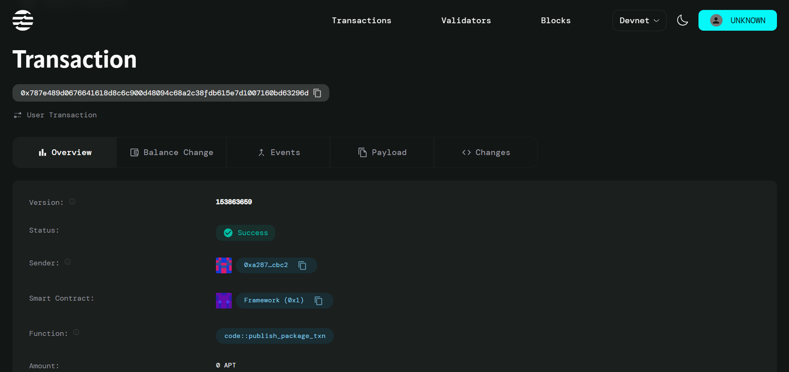

# Local Farmer Co-Op Price Agreements

## Project Description

A blockchain-based smart contract system implemented by farmers' cooperatives (Co-Op) to revolutionize agricultural trade through transparent pricing mechanisms. The system ensures fair pricing for farmers by setting minimum guaranteed prices for each crop type, preventing buyers from purchasing below these thresholds. All transactions are recorded on an immutable ledger, providing transparency and accountability for farmers, buyers, and regulatory bodies. The smart contract automates payment release to farmers upon delivery confirmation, effectively eliminating middleman interference and ensuring direct, fair compensation.

## Project Vision

To create a decentralized, transparent, and fair agricultural marketplace that empowers farmers through guaranteed minimum pricing while building trust between all stakeholders in the agricultural supply chain. Our vision is to eliminate exploitation in agricultural trade, ensure food security through fair compensation to farmers, and create a sustainable ecosystem where technology serves the farming community's best interests.

## Key Features

- **Minimum Price Guarantee**: Smart contract enforces minimum guaranteed prices for different crop types, protecting farmers from market manipulation
- **Price Validation**: Automated validation ensures all purchase transactions meet or exceed the minimum price requirements
- **Immutable Transaction Records**: All transactions are permanently recorded on the blockchain, providing complete transparency and audit trails
- **Direct Payment System**: Automated payment transfer from buyers directly to farmers upon transaction completion
- **Middleman Elimination**: Direct farmer-to-buyer transactions reduce costs and increase farmer profits
- **Multi-Stakeholder Accessibility**: Transparent ledger accessible to farmers, buyers, and regulatory authorities
- **Cooperative Administration**: Co-op administrators can set and update minimum prices based on market conditions and farmer needs
- **Transaction Analytics**: Built-in tracking of total transactions and market activity for data-driven decision making

## Future Scope

- **Multi-Crop Support**: Expand to support multiple crop types with individual pricing structures
- **Quality Grading System**: Implement crop quality assessment and corresponding price tiers
- **Seasonal Price Adjustments**: Dynamic pricing based on seasonal demand and supply patterns
- **Insurance Integration**: Incorporate crop insurance mechanisms for additional farmer protection
- **Supply Chain Tracking**: End-to-end tracking from farm to consumer for complete transparency
- **Mobile Application**: User-friendly mobile interface for farmers and buyers to interact with the smart contract
- **Regional Co-Op Networks**: Connect multiple regional cooperatives for broader market access
- **Government Integration**: Direct integration with agricultural subsidies and government support programs
- **Predictive Pricing**: AI-driven price prediction and recommendation systems
- **Delivery Verification**: IoT-based automated delivery confirmation and quality verification

## Contract Details

0x787e489d0676641618d8c6c900d48094c68a2c38fdb615e7d1007160bd63296d

